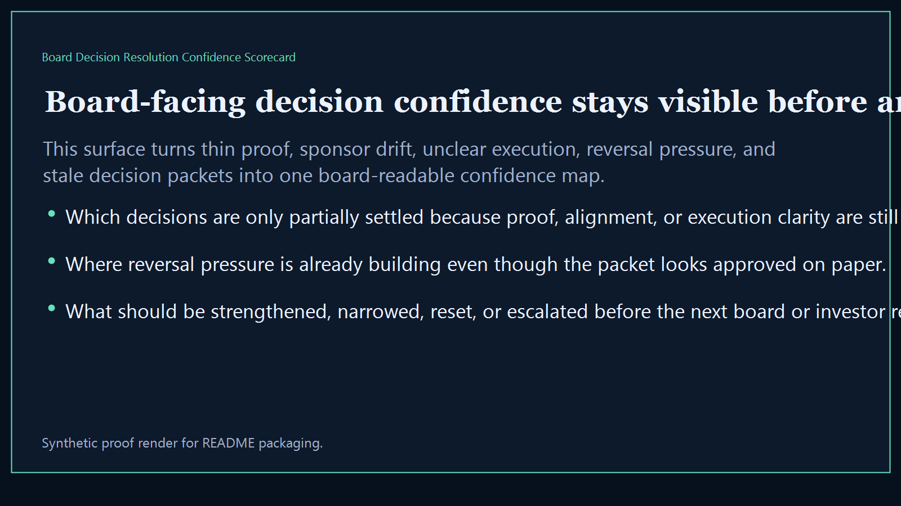
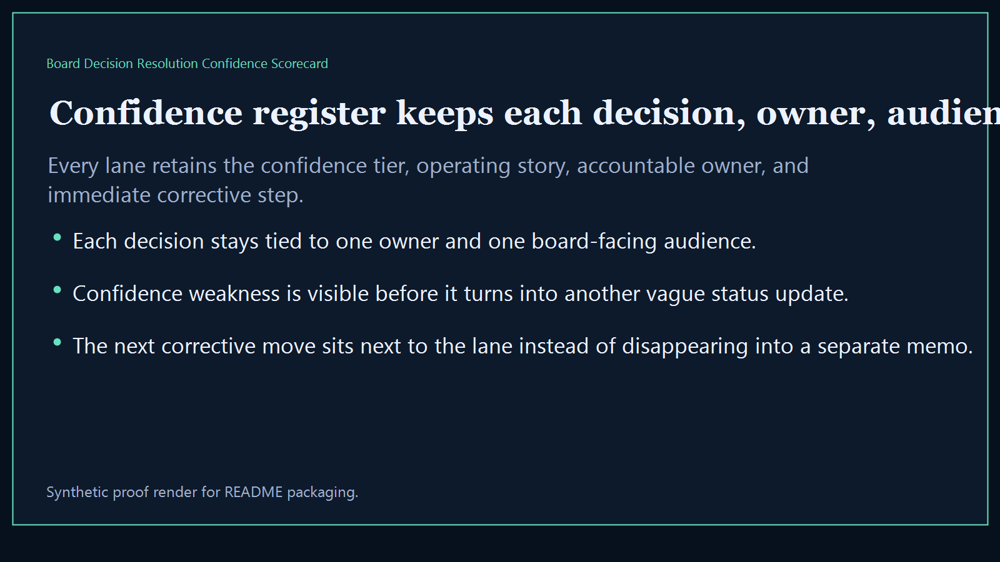
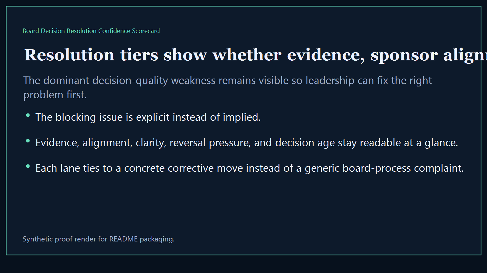
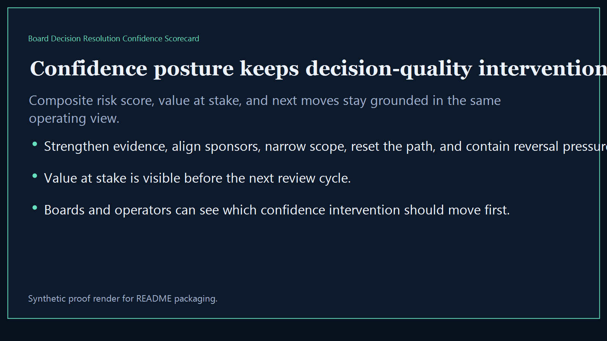

# Board Decision Resolution Confidence Scorecard

Board-ready executive-intelligence surface for scoring decision resolution confidence, evidence quality, sponsor alignment, and reversal risk across the broader Kinetic Gain suite.

- Live: `http://confidence.kineticgain.com/`
- Repo: `mizcausevic-dev/board-decision-resolution-confidence-scorecard`

## Why this matters

Leaders need one board-readable confidence score that shows which decisions are actually stable, which ones are under-evidenced, and where reversal risk is high enough to warrant intervention before the next committee or investor review.

## What it includes

- TypeScript executive-intelligence surface for tracking decision confidence, evidence coverage, sponsor quality, and reversal pressure
- synthetic lanes across multiple sectors, owner groups, and board-visible execution risks
- reusable outputs for confidence register, resolution tiers, posture narratives, and board-ready recovery prompts
- prerendered static site, JSON payloads, screenshots, and docs

## Routes

- `/`
- `/confidence-register`
- `/resolution-tiers`
- `/confidence-posture`
- `/verification`
- `/docs`

## Local run

```bash
cd board-decision-resolution-confidence-scorecard
npm install
npm run verify
npm run prerender
npm run render:assets
```

## CLI

```bash
npx board-decision-resolution-confidence-scorecard fixtures/board-decision-resolution-confidence-scorecard.json --format summary
npx board-decision-resolution-confidence-scorecard fixtures/board-decision-resolution-confidence-scorecard-clean.json --format json
```

## Docs

- [Architecture](docs/architecture.md)
- [Origin](docs/ORIGIN.md)
- [Kinetic Gain Embedded](docs/KINETIC_GAIN_EMBEDDED.md)

## Screenshots





